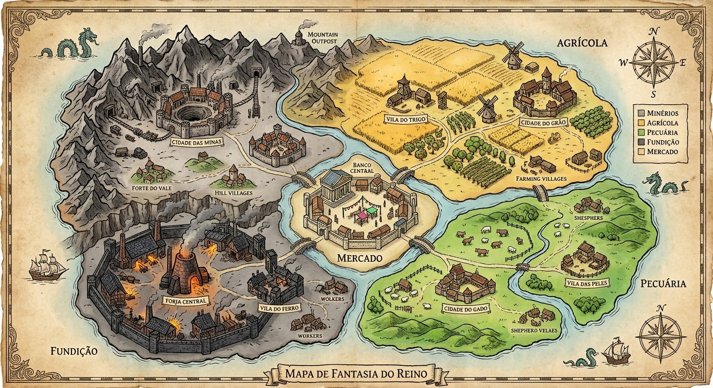

# Jogo Isométrico — Rascunho de Design (v0.1)

> Documento vivo. Objetivo: fechar uma base mínima de história e mecânicas antes de decidir tecnologia. Itens marcados como `[PENDENTE]` ainda precisam de refinamento.

---

## 1. Conceito

Jogo isométrico (estilo PZ e afins), com narrativa central sobre **vingança, ódio ou amor** — a decisão de qual caminho seguir é do jogador, não é fixa.

---

## 2. Personagem

- **Sexo:** escolhível
- **Raça:** Humano, Elfo, Vampiro, Anão
- **Classe:** Livre, Trabalhador, Soldado, Bardo, Guerreiro, Mago + 4 classes específicas por raça (16 no total, ver 2.2)
- **Relação classe × raça:** **preferência, não bloqueio** — qualquer raça pode jogar qualquer classe, mas a combinação nativa da raça dá bônus.

### 2.1 Bênçãos e Maldições (lista base)
- **Bênçãos:** Devoto, Sortudo, Diplomata, Observador, Resistente
- **Maldições:** Pacto de Sangue, Herege, Mentiroso, Licantropia

### 2.2 Classes Específicas por Raça

| Raça | Classe 1 | Classe 2 | Classe 3 | Classe 4 |
|---|---|---|---|---|
| Humano | Cavaleiro (Armas-Longas + Armaduras) | Mercador (Comércio + Carisma) | Erudito (Magia generalista + Inteligência) | Batedor (Percepção + Furtividade) |
| Elfo | Arqueiro Élfico (Armas-Distância + Percepção) | Druida (Magia natureza + Medicina/Cura) | Encantador (Armas-Mágicas + Fabricação) | Guardião da Floresta (Agilidade + Armas-Curtas) |
| Vampiro | Sanguinário (Armas-Curtas + Força, dreno de vida) | Nobre das Sombras (Carisma + Furtividade) | Necromante (Magia sombria + Inteligência) | Caçador Noturno (Furtividade + Armas-Distância) |
| Anão | Ferreiro de Guerra (Fabricação + Armaduras) | Guardião das Minas (Armaduras + Stamina) | Explosivista (Armas-Explosivo + Percepção) | Rúnico (Armas-Mágicas + Fabricação) |

### 2.3 Raça Vampiro — Construção Especial

Vampiro jogável **não é a mesma coisa** que a facção inimiga (a colmeia, ver 9.3/Terra Cinza) — é um **desviante**: escolheu viver entre mortais em vez de se juntar ao ninho, o que faz a própria colmeia o enxergar como traidor/fraco. Rejeitado pelos dois lados — mortais têm medo dele, vampiros "de verdade" o desprezam por se conter. Isso evita romantizar a raça.

- **Sede de Sangue** (obrigatória, não opcional): precisa se alimentar de sangue periodicamente ou sofre penalidades crescentes (Stamina reduzida, pior em combate, Sanidade caindo se ignorar por tempo demais).
  - **Alimentação "limpa"** (sangue animal, ou doação consentida): alívio parcial/mais lento, sem custo de Bondade.
  - **Alimentação "suja"** (drenar de vítima não consentida, ferindo ou matando): alívio total/imediato, mas Bondade despenca (é assassinato) e risco de ser descoberto/caçado.
- **Fraqueza solar:** morre se exposto ao sol direto por **1/3 do dia contínuo** (5 minutos reais, na escala de 1 dia = 15 min, ver 13) — precisa gerenciar atividade diurna com cuidado (abrigo, sombra).
- **Compensador racial:** +2 níveis efetivos em **Agilidade e Percepção** (reflexos sobrenaturais e sentidos aguçados no escuro), sempre ativos — ao contrário da Sede de Sangue e da fraqueza solar, não depende de nenhuma condição.
- **Vampiro é raça de nascença** (os pais também são vampiros) — a família já vive como desviantes há gerações, adaptada à luz do sol: propriedade com muita sombra, e o personagem usa roupas que cobrem todo o corpo + chapelão. O prefácio (8.1) acontece normalmente pra essa raça, só com essa adaptação implícita — não é uma história separada.

---

## 3. Árvore de Habilidades

Todas as ações do jogo (combate, vendas, identificação de itens, conversas, diplomacia) passam pela mesma tabela de habilidades — raça, classe, bênçãos e maldições afetam essa tabela.

**Lista completa (19 habilidades):**
Força, Agilidade, Inteligência, Percepção, Carisma, Stamina, Magia, Armas-Mágicas, Armas-Curtas, Armas-Longas, Armas-Distância, Armas-Explosivo, Armaduras (leve/média/pesada/mágica), **Furtividade**, **Comércio/Negociação**, **Fabricação/Ofício**, **Agricultura**, **Medicina/Cura**, **Liderança**.

**Regras:**
- Cada habilidade evolui de 0 a 10 (com XP entre níveis).
- Só é possível upar até **60% do total de níveis possíveis** (ex: 19 habilidades × 10 níveis = 190 níveis totais → 114 níveis distribuíveis).
- Itens/armas específicas de classe (ex: cajado mágico) só funcionam plenamente com a habilidade correspondente — sem ela, viram equipamento genérico (ex: cajado vira porrete).
- Armadura pesada sem habilidade correspondente prejudica a **locomoção**, mas não reduz a defesa.

### 3.1 Sistema de Magia

**Custo de conjuração:** feitiços comuns gastam **Stamina**; feitiços de tier alto ou da escola Sombria/Necromancia também gastam **Sanidade** (usar magia forte/proibida cobra um preço mental real).

**5 escolas de magia:**

| Escola | Foco | Classe ligada |
|---|---|---|
| Elemental | Água, Fogo, Terra, Ar, Energia — dano e utilidade por sub-elemento (ex: fogo → explosões, água → chuva, ar/terra → fumaça/poeira) | Erudito/Mago |
| Necromancia | Debuff de Carisma (aura de medo/repulsa) + **Reanimar** — reanima corpos caídos em combate | Necromante |
| Destruidor | Evolução combinada das outras escolas — maior raio de ação, debuff de Medo, alto nível/tardio na progressão | (capstone, qualquer mago avançado) |
| Cura e Transmutação | Cura + transformação (em animais e seres aleatórios) | Druida |
| Rúnica | Encantamento de itens/runas — desenvolvida separadamente (ver Runas abaixo) | Rúnico/Encantador |

**Invocação e Runas:**
- **Reanimar** (Necromancia) é a **única magia de invocação sem limite de quantidade** — só limitada por tempo de duração (reanima quantos corpos caídos quiser, contanto que tenha tempo).
- **Toda outra invocação não é magia — é via Runas**: você invoca quantas criaturas tiver runas pra sustentar (limite = quantidade de runas no inventário, não tempo/cooldown). Não existe "magia de invocação" genérica fora disso.

**As 7 Runas:**
| Runa | Efeito |
|---|---|
| Cura | Cura em raio — **afeta inimigos também** se mal posicionada |
| Fumaça | Cria nuvem de fumaça na área |
| Explosiva | Dano em área — **afeta aliados também** se mal posicionada |
| Chuva | Cria chuva na área — combina com magia elétrica (Elemental) pra dano amplificado |
| Limpo | Chance de abrir um portal que suga tudo na área pro limbo — **sem retorno**, afeta qualquer um ali |
| Proteção | Anula qualquer hit na área durante a duração — **ninguém ataca nem é atacado**, amigo ou inimigo |
| Invocação | Convoca ajuda (animal/espírito) |

Todas as Runas (exceto Reanimar) são **indiscriminadas** — atingem aliado e inimigo igual, exigindo posicionamento cuidadoso. É o contraponto de risco/recompensa aos feitiços das 5 escolas, que são controlados.

**Crafting de Runas** (cadeia em 3 camadas):
```
Pedra de Runa Base  = 1 Pedaço de Pedra (1/20 de 1kg) + 5,0 de lapidação
Pedra de Runa Vazia = 1 Pedra de Runa Base + 4 Fragmentos de Cristal Azul (1/10 de 1 unid. cada) + 8,0 de encantamento base
```
(calculado em Terra Cinza, fonte de Pedra e Cristal Azul) → **Pedra de Runa Vazia = 15,45**

| Runa | Material extra | Encantamento final | Preço final |
|---|---|---|---|
| Chuva | água | 15,0 | 31,5 |
| Fumaça | 2 Enxofre | 18,0 | 37,5 |
| Invocação | 2 Osso | 20,0 | 39,5 |
| Explosiva | 2 Salitre | 25,0 | 46,5 |
| Cura | 2 Ervas Medicinais | 22,0 | 47,5 |
| Proteção | 2 Barra de Prata | 35,0 | 86,5 |
| Limpo | 1 Ferro Estelar | 60,0 | 125,5 |

A escala de preço reflete o perigo/poder — Limpo (portal sem volta) é disparado a mais cara, Chuva é a mais barata/utilitária.

---

## 4. Combate

Combate **não** usa o sistema de sorte por bilhetes — usa fórmula própria com variação controlada.

```
Dano_Base      = Poder_Arma × Multiplicador_Raridade
Bônus_Perícia  = Nível_Habilidade_Arma × Fator_Escala (2 por nível)
Dano_Bruto     = Dano_Base + Bônus_Perícia
Variação       = aleatório entre -25% e +25%
Dano_Ajustado  = Dano_Bruto × (1 + Variação)

Defesa_Efetiva = Defesa_Armadura × Multiplicador_Raridade_Armadura
Dano_Final     = máximo(1, Dano_Ajustado − Defesa_Efetiva)
```

### 4.1 Tiers de Armas e Armaduras
4 níveis, mesma escala para ambos: **Comum ×1.0 | Melhorada ×1.25 | Rara ×1.5 | Única ×2.0**

---

## 5. Sistema de Sorte (Bilhetes)

Usado para **tudo, exceto combate**: diálogo, negociação, identificação de itens, decisões narrativas, aquisição/perda de bênçãos e maldições, eventos de descoberta, etc.

- Sempre 200 bilhetes distribuídos aleatoriamente entre os resultados possíveis, proporcional às chances de cada evento.
- Sorteia-se 1 bilhete pra saber o resultado — sem viés perceptível de sequência.

---

## 6. Moralidade

### 6.1 Bondade
- Escala 0–100, começa em **60**.
- Toda ação (boa ou ruim) altera esse valor.

### 6.2 Sanidade
- Escala 0–100, começa em **80** (perto do máximo — o personagem ainda não viu nada de ruim no início do jogo).
- Afeta o medo que as pessoas sentem de você e sua percepção do mundo.
- Reduzida por atos como matar inocentes.
- **Sanidade baixa = risco de perder o controle** na forma de lobisomem (ver Maldições).

---

## 7. Bênçãos e Maldições — Sistema Completo

### 7.1 Aquisição de Bênçãos
1. **Bênção dos pais** (1ª, principal): escolhida na criação do personagem, recebida narrativamente (ex: na igreja/templo). Uma das 5: Devoto, Sortudo, Diplomata, Observador, Resistente.
2. **Bênçãos de NPC** (até 10 no total, incluindo a "do trabalho" ganha aleatoriamente no prefácio): concedidas por NPCs comuns em diálogo (ex: "Que Deus abençoe sua vida e lhe dê saúde" → +vida máxima). Exigem **Bondade alta + sorteio**.
3. **Perda de bênção:** ligada a Bondade baixa + sorteio. **Permanente — não há como recuperar.**

### 7.2 Efeitos das Bênçãos
| Bênção | Efeito |
|---|---|
| Devoto | +15% resistência à perda de Sanidade em eventos violentos; Bondade sobe 10% mais rápido em ações positivas |
| Sortudo | Em qualquer sorteio de bilhete, tira 2 e fica com o melhor resultado |
| Diplomata | +2 níveis efetivos em Carisma e Comércio; ganho de Influência positiva +10% |
| Observador | Vê a % real dos bilhetes antes de decisões importantes; +2 níveis efetivos em Percepção |
| Resistente | -10% no Dano_Final recebido em combate; resistência a efeitos de status |

### 7.3 Aquisição de Maldições
1. **Maldição inicial** (0 ou 1): escolhida na criação, com origem narrativa ligada a um inimigo (vampiro, Lord, etc.).
2. **Maldições adicionais** (até 10, simétrico às bênçãos): adquiridas por ações específicas (ex: conquistar cidade pelo medo, extorquir, matar inocentes). Sorteio ponderado por **Influência negativa + Bondade baixa juntas**.
3. Toda maldição é uma faca de dois gumes: dá uma vantagem **e** um custo.

### 7.4 Efeitos das Maldições
| Maldição | Efeito |
|---|---|
| Pacto de Sangue | Bônus de dano contra Vampiros + habilidade de dreno de vida; perde 5% de Sanidade automaticamente por semana; facções "puras" (Lord) começam com -10% de Influência base |
| Herege | -15% de Influência positiva em cidades religiosas/do Lord; +15% na velocidade de ganho de Influência negativa |
| Mentiroso | Bônus de bilhetes ao mentir em diálogo; se pego, penalidade em dobro na Bondade e perde a confiança daquele NPC/facção pra sempre |
| Carrasco | Inimigos sentem medo (-5% força deles em combate contra você); mais difícil ganhar Bondade das pessoas; reduz Carisma |
| **Licantropia** | Transforma-se em lobisomem por vontade própria (mais fácil/automático em lua cheia); enquanto transformado: +Força/+Stamina e regeneração de vida contínua; NPCs comuns têm medo da forma **independente da Bondade real**; ganha afinidade extra com o clã Lobisomens; **perde o controle apenas se a Sanidade estiver baixa** |

### 7.5 Ritual de Redenção
Permite remover maldições doando recursos e reduzindo o exército — custo e eficácia pioram a cada uso:

| Uso | Custo (recursos / soldados) | Remove | Ganha |
|---|---|---|---|
| 1º | 50% / 25% | 100% das maldições | Bênção Renascimento (efeito cheio) |
| 2º | 70% / 45% | 50% das maldições | Bênção Renascimento (efeito reduzido) |
| 3º | 90% / 70% | 33% das maldições | — (Renascimento não é mais concedido) |
| 4º+ | 90% / 70% | Nada | Maldição "Enganador" |

---

## 8. História Principal

### 8.1 Prefácio (antes da vingança)
- Personagem faz atividades cotidianas: lavrar o campo com o pai, construir celeiro, colher frutas, cortar madeira, comprar pregos no mercado, alimentar animais.
- Mensageiro anuncia que plantações do reino vizinho foram queimadas por monstros — inicia task de colher e armazenar no celeiro.
- Personagem conhece um par romântico, constrói casa própria em terreno cedido pelo pai.
- No mercado, ouve comentário de que o Lord está ganancioso — triplicou o preço dos itens vendidos ao reino atacado.
- Muda de estação: adota um cão e um gato, faz ração misturando itens, negocia venda de um bezerro.
- **Ganha a 1ª bênção "dos pais"** e, ao longo do trabalho, a **2ª bênção "do trabalho"** (aleatória).

### 8.2 O Ataque (virada da história)
- Ao voltar da venda dos bezerros, o personagem é atacado e desmaia.
- Ao acordar, escolhe um pensamento (afeta a Sanidade).
- Cidade destruída, pessoas chorando e procurando umas às outras; castelo do Lord intacto e vazio.
- Em casa: pais e esposa/marido mortos; resta apenas o cão, ferido.
- **Decisão via sorteio (200 bilhetes, 80 de sobreviver / 120 de morrer):** salvar o cão (leva ao curandeiro), deixá-lo morrer, ou sacrificá-lo.
- **A história de verdade começa aqui.**

**Exílio:** com o Lord já dominando Vale Verde (ver 9.3) e sem recursos ou exército, ficar ali seria suicídio — o jogador foge pra **Província dos Campos** (território Rebelde), reconstrói força lá como Independente, e só retorna pra reclamar Vale Verde quando estiver pronto. Dá um arco de exilado → poderoso → volta pra casa.

### 8.3 Caminhos morais extremos
- **Bondade > 90%:** pode abandonar a vingança e seguir um caminho de proteção às pessoas — culmina na destruição do Lord.
- **Bondade < 15%:** pode criar uma bomba potente o suficiente pra destruir os inimigos, mas será odiado pelas mortes de inocentes.

---

## 9. Clãs

> **Decisão de escopo:** o jogador sempre joga como **Independente** — não há mais escolha entre 3 clãs no início da história. Rebelde e Vingadores passam a ser **facções NPC**, com quem só é possível ter guerra ou parceria (não é possível se juntar a elas).

| Clã | Papel |
|---|---|
| **Independente** *(jogável)* | Começa do zero — recrutamento, assentamento, controla toda a distribuição de lucro e decisões, domínio de aldeias/cidades/províncias (ver seções 12 e 15) |
| **Rebelde** *(NPC)* | Facção que "faz o bem" à sua maneira — pode ser aliada ou inimiga do jogador |
| **Vingadores** *(NPC)* | Facção sem escrúpulos, pode matar inocentes em suas próprias ações — pode ser aliada ou inimiga do jogador |

### 9.1 Clãs neutros e inimigos
- **Lobisomens** (neutro): versão consciente da fera, amaldiçoados mas com controle; percepção das pessoas sobre eles pode mudar.
- **Soldados do Lord** e **Vampiros** (inimigos, sempre hostis ao jogador).

### 9.2 Relações do jogador (Independente) com as demais facções
| Facção | % de amizade | Observações |
|---|---|---|
| Lobisomens | 50% | Não atacam, mas também não ajudam; nunca atacam vilas |
| Lord | 0% | Inimigo fixo — ataca vilas dia e noite |
| Vampiros | 0% | Inimigo fixo — ataca vilas só à noite |
| Vingadores | 45% | Não gostam do jogador; atacam vez ou outra |
| Rebelde | 50% | Relação inicial neutra/positiva |

**Faixas gerais:** <20% = conflito sempre + ataque esporádico a vila · 50–79% = indiferente · >80% = apoio em conflito

**Regras fixas de ataque:** Lobisomens nunca atacam vilas · Vampiros atacam vilas inimigas só à noite · Lord ataca vilas inimigas dia e noite.

**Mercado entre facções:** relação acima de 50% libera comércio (compra e venda).

**Mecânica especial:** cristais azuis simulam luz UV — criam zona de proteção contra vampiros mesmo à noite.

### 9.3 Facção Dominante Inicial por Província

O jogador nasce em Vale Verde (bate com a história do bezerro/vacas/campo, e é a província com mais vizinhas, boa pra explorar desde o início):

| Província | Cidades | Facção dominante |
|---|---|---|
| Vale Verde | Vila das Peles + Cidade do Gado | **Lord** (terra natal do jogador, ocupada — reforça a vingança pessoal) |
| Província dos Campos | Vila do Trigo + Cidade do Grão | **Rebelde** |
| Província dos Fundidores | Vila do Ferro + Forja Central | **Vingadores** |
| Terra Cinza | Forte do Vale + Cidade das Minas | **Vampiros** (minas escuras reforçam a lore da caverna secreta, ver 12.1.1) |
| Província das Rotas | Confluência | **Neutra** (hub comercial de todos) |

*Lobisomens não dominam território urbano — são presença rural/selvagem, ligada à caverna secreta e ao mundo fora das cidades.*

*Terra Cinza é a única província sem rota diplomática — Vampiros são sempre hostis (0% de relação, sem negociação possível), então tomá-la exige conquista militar pura, nunca jogo político via Influência positiva. Design intencional: dá variedade ao jogo (as outras províncias permitem negociação, essa não).*

---

## 10. Influência entre Clãs (por cidade)

```
Ação positiva:
  Influência_Positiva += Base × 1.03
  Influência_Negativa -= Base × 0.8

Ação negativa:
  Influência_Negativa += Base
  Influência_Positiva -= Base × 1.2

Score_Facção = (Influência_Positiva + Influência_Negativa) / 2
→ a facção com maior Score domina a cidade (não importa se veio de medo ou apoio espontâneo)

Influência_Positiva > 50% → rota de comércio garantida (independente de dominar a cidade)
Sem rota → 20% de imposto por venda (contrabando)
```

---

## 11. Cidades e Casas (pontos seguros)

- **9 cidades** (ver 12.1–12.3), cada uma com suas próprias trilhas de Influência por facção e presença de soldados (redutível a 5–10% pela facção dominante).
- **Casa (ponto seguro):** construída com recursos (madeira, pregos, pedra, etc.). Concede: armazenamento, viagem rápida, estação de crafting/construção, recrutamento de soldados, coleta/configuração de recursos (doações, extorsão).
  - **Exclusivo Independente:** configurar % de distribuição entre comunidade / propaganda (recrutamento) / proteção / base principal.
- Em **cidade inimiga**, construir a Casa exige a habilidade **Espião** — nesse contexto, a Casa também é chamada de **Esconderijo** (mesmo conceito, nome alternativo usado quando é clandestina).
- Pode ter várias Casas compradas, mas **só uma ativa como base** por vez (dá pra trocar rápido se descoberta).
- **Casa alugada não pode virar base.** Cada Casa tem custo de compra + manutenção.
- **Descoberta:** 0–50% de chance de ataque, crescendo por dia; força do ataque escala com a Influência da facção dona da cidade. Após descoberta, precisa de **1 mês de jogo (30 dias)** de resfriamento antes de poder virar base ali de novo.

### 11.1 Aquisição de Terreno e Construção

Três caminhos pra conseguir uma Casa, com trade-off de custo × tempo:

**1. Comprar pronta (turnkey):** preço cheio da seção 16.10 — instantâneo, terreno e estrutura já inclusos.

**2. Comprar Terreno vazio (40% do preço da Casa pronta) + construir**, escolhendo o tipo:
| Tipo de Construção | Materiais | Tempo | Defesa estrutural |
|---|---|---|---|
| Simples (Madeira) | 20 Tábua + 10 Prego + 5,0 mão-de-obra | 3 dias | 5 |
| Reforçada (Madeira+Tijolo) | 15 Tábua + 15 Tijolo + 10 Prego + 8,0 mão-de-obra | 5 dias | 10 |
| Sólida (Pedra+Ferro) | 20 Pedra + 10 Barra de Ferro + 10 Prego + 12,0 mão-de-obra | 8 dias | 20 |

*Tijolo (novo item derivado): 0,5kg Argila + 0,2 mão-de-obra.*

**3. Comprar Casa Destruída (20% do preço da Casa pronta)** — mais barata ainda, mas exige **Demolição** (10 Moedas + 1 dia de trabalho, limpar entulho) antes de escolher um dos 3 tipos de Construção acima.

**Comparando em Campos (Casa pronta = 200):**
| Caminho | Custo total | Tempo total |
|---|---|---|
| Turnkey (pronta) | 200 | Instantâneo |
| Terreno vazio (80) + Simples | 109 | 3 dias |
| Terreno vazio + Reforçada | 117,5 | 5 dias |
| Terreno vazio + Sólida | 176 | 8 dias |
| Casa Destruída (40) + Demolição (10) + Simples | 79 | 4 dias |
| Casa Destruída + Demolição + Reforçada | 87,5 | 6 dias |
| Casa Destruída + Demolição + Sólida | 146 | 9 dias |

Casa Destruída é sempre a opção mais barata em qualquer tier — o preço de barganha compensa o trabalho extra de demolir. Turnkey é a mais cara, mas instantânea.

**Base do Clã:** usa a receita **Sólida em escala 5×** (materiais e mão-de-obra ×5, ~20 dias) — dá **480 Moedas** na referência de Campos, bem próximo do valor de 500 já fixado (seção 16.10) para o assentamento inicial.

---

## 12. Economia Regional

> **Regra fundamental:** dinheiro (moeda e ouro) é tratado como **item/recurso físico** no jogo — não é um número abstrato. Tem peso/volume que ocupa capacidade de carga de carroça (limitando quanto uma viagem consegue transportar), por isso precisa de carroça + escolta pra se mover entre lugares, igual a qualquer outro recurso (minério, comida, armas). Dinheiro carregado pelo próprio personagem (fora do banco) também pode ser roubado por assaltantes/bandidos comuns na estrada.

### 12.1 Províncias
Mapa dividido em **5 províncias**, cada uma com uma especialidade:
- **Minérios** (ouro, ferro, prata, etc.)
- **Agricultura** (grãos, legumes, bebidas)
- **Pecuária** (animais criados e pescados)
- **Comércio** (província central — conecta todas as outras, vive de bancos e comércio)
- **Fundição** (compra minério das outras províncias e transforma em armas/ferramentas)

### 12.1.1 Mapa e Adjacência
Topologia em cadeia + hub central (não é um anel fechado):
- **Minérios** ↔ Agrícola, Mercado *(bloqueada por montanhas do outro lado)*
- **Agrícola** ↔ Minérios, Pecuária, Mercado
- **Pecuária** ↔ Agrícola, Fundição, Mercado
- **Fundição** ↔ Pecuária, Mercado
- **Mercado (Comércio)** ↔ todas as 4

**Minérios e Fundição não são vizinhas entre si** — a rota mais crítica do jogo (minério → fundição) sempre passa por pelo menos 2 saltos (via Agrícola-Pecuária) ou pelo Mercado, reforçando o papel do Mercado como pedágio da cadeia econômica mais importante do mapa. **Na lore, isso se materializa como uma cordilheira contínua (ou desfiladeiro) separando as duas regiões** — não existe passagem terrestre direta entre elas.

**Mercado é uma ilha:** fica isolado numa confluência de rios, cercado de água por todos os lados. Cada uma das 4 províncias se conecta a ele por **exatamente uma ponte de pedra própria** — não existe estrada terrestre direta até lá. Isso reforça mecanicamente por que cruzar até o Mercado sempre depende de travessia (chokepoint de emboscada/pedágio, mesma mecânica de escolta).

**Assimetria estratégica:** Minérios e Fundição (2 vizinhas cada) são mais defensáveis, mas dependem de poucas rotas; Agrícola e Pecuária (3 vizinhas cada) são mais centrais/valiosas como corredor, mas mais expostas; Mercado (4 vizinhas) é o hub, mais valioso e mais exposto diplomaticamente.

**Rio:** nasce nas montanhas de Minérios, corta Agrícola e Pecuária, e deságua/forma confluência no Mercado — motivo histórico plausível de o Mercado ter virado o hub comercial do mapa. Cria pontos de travessia (pontes/vaus) que funcionam como chokepoints de emboscada/pedágio, usando a mesma mecânica de escolta.

**Mapa de referência (rascunho visual):**



### 12.1.2 Nomenclatura de Assentamentos
Nomes de lore das províncias (a mecânica continua se referindo a elas pelo nome funcional — Minérios, Agrícola, Pecuária, Fundição, Mercado):
- **Minérios** — "Terra Cinza"
- **Agrícola** — "Província dos Campos"
- **Pecuária** — "Vale Verde"
- **Fundição** — "Província dos Fundidores"
- **Mercado** — "Província das Rotas"

**Minérios:**
| Assentamento | Nome |
|---|---|
| Cidade de Manutenção | Forte do Vale |
| ↳ Aldeia | Poço Estreito |
| ↳ Aldeia | Campo Alto |
| ↳ Aldeia | Veio Cinzento |
| Cidade Especializada | Cidade das Minas |
| ↳ Aldeia | Vila da Encosta |
| ↳ Aldeia | Rocha Funda |
| ↳ Aldeia | Poço do Norte |
| Posto de Montanha | Guarda do Passo |

**Agrícola:**
| Assentamento | Nome |
|---|---|
| Cidade de Manutenção | Vila do Trigo |
| ↳ Aldeia | Campo Dourado |
| ↳ Aldeia | Moinho Velho |
| ↳ Aldeia | Ribeira Verde |
| Cidade Especializada | Cidade do Grão |
| ↳ Aldeia | Vinha Alta |
| ↳ Aldeia | Pomar do Sol |
| ↳ Aldeia | Celeiro Novo |

**Pecuária:**
| Assentamento | Nome |
|---|---|
| Cidade de Manutenção | Vila das Peles |
| ↳ Aldeia | Curral Verde |
| ↳ Aldeia | Vale dos Pastores |
| ↳ Aldeia | Lagoa Mansa |
| Cidade Especializada | Cidade do Gado |
| ↳ Aldeia | Colina do Rebanho |
| ↳ Aldeia | Vau das Ovelhas |
| ↳ Aldeia | Prado Fundo |

**Fundição:**
| Assentamento | Nome |
|---|---|
| Cidade de Manutenção | Vila do Ferro |
| ↳ Aldeia | Carvoaria Negra |
| ↳ Aldeia | Fole Velho |
| ↳ Aldeia | Escória Funda |
| Cidade Especializada | Forja Central |
| ↳ Aldeia | Bigorna Alta |
| ↳ Aldeia | Fumaça Baixa |
| ↳ Aldeia | Rocha Quente |

**Mercado:**
| Assentamento | Nome |
|---|---|
| Cidade única | Confluência |

**Posto de Montanha (Guarda do Passo):** um assentamento perto de Minérios que pode se tornar uma **rota secreta** entre Minérios e Fundição — as duas províncias que, na lore, não têm nenhuma passagem terrestre direta entre si. A rota se abre através da seguinte quest:

**Quest "A Aldeia que Perde Gente":** uma aldeia perto da montanha, do lado de Fundição, começa a perder moradores. A investigação revela um vampiro como responsável. Com conhecimento (skill/lore) sobre vampiros, o jogador descobre que eles vivem em colmeias — a maioria fica no ninho, só alguns saem pra caçar. Três caminhos:
- **Matar** o vampiro: elimina a ameaça, mas nunca descobre a caverna.
- **Capturar:** risco de outros vampiros virem resgatá-lo — mesmo emboscando e matando todos, ainda não se descobre a caverna.
- **Observar** (seguir sem intervir): revela a localização da colmeia/caverna.

Ao limpar a caverna e explorá-la até o fim, encontra-se uma **porta selada** — destrutível com explosivos (da Vila de Minérios, ligado a Armas-Explosivo) ou com magia potente (personagem Mago). Isso **abre a passagem secreta entre Minérios e Fundição** através da montanha.

**Compra da caverna:** é possível comprar os direitos sobre a caverna do dono atual, com o preço escalando conforme o momento da compra:

| Momento da compra | Preço | Discurso do vendedor |
|---|---|---|
| Com os vampiros ainda dentro | Ridiculamente barato | Explica que vende barato porque não vale o risco |
| Depois de limpar (sem vampiros) | 5× o preço anterior | Mostra o preço de antes e o atual; explica que ainda compensa como armazém ou pra exploração |
| Depois de abrir a porta (rota criada) | 100× o preço anterior | Explica que quem controlar aquela região terá "rios de dinheiro" |

**Linha do tempo de dicas in-game:** ao investigar o caso, um NPC comenta que o lugar está à venda por um preço ridículo, "que valeria a pena se não fosse os vampiros" (permite comprar ali mesmo, arriscado). Ao entrar na caverna, uma mensagem avisa que pode ser um bom lugar se for limpo, que talvez compense aproveitar o preço. Depois de limpar, outra mensagem confirma que vale a pena agora que não há mais vampiros.

**Melhorias da caverna** (dono pode investir em 3 árvores independentes):

*Melhoria Geral (4 níveis, cumulativos):* 1) caminho · 2) passagem · 3) iluminação · 4) pequenos comércios — **o nível 4 é o que libera a árvore de Lojas abaixo**.

*Segurança (4 níveis, cumulativos):* 1) guardas em ambos os lados · 2) + rondas · 3) + portões em ambos os lados · 4) + assistência médica e postos de descanso.

*Lojas (2 níveis, cumulativos — desbloqueada pela Melhoria Geral nível 4):* 1) lojinhas internas · 2) lojas, pubs e um banquinho pequeno.

*Transporte (3 níveis, gerando renda passiva):* 1) transporte por pessoas (funciona mesmo com a mina apertada, sem pré-requisito) · 2) carrinho de mão (exige Melhoria Geral nível 2) · 3) carroça (exige Melhoria Geral nível 3). Todos os níveis podem ser usados pelo próprio jogador pra transportar seus itens. **Pedágio configurável pelo dono** — comerciantes sempre atravessam (é a única rota entre Minérios e Fundição), mas o **volume de tráfego** cai conforme a economia das duas províncias conectadas piora (moeda desvalorizada, crescimento fraco). Separadamente, o **preço do serviço de transporte** decide se os comerciantes pagam pra usar carrinho/carroça ou preferem carregar por conta própria — preço baixo, maioria usa o serviço; preço alto, maioria carrega sozinha.

**Jurisdição:** a caverna pertence administrativamente à **Fundição** (é de lá que a compra é negociada) — aceita a moeda de Fundição nativamente, e o banquinho do nível 2 de Lojas segue a taxa base de Aldeia/Manutenção (15%, ver 12.12.6).

### 12.2 Estrutura de Cidades e Aldeias
Cada província (exceto Comércio — ver 12.3) tem **2 cidades**, cada uma com **3 aldeias**:
- **Cidade de Manutenção:** garante a autossuficiência da província. Aldeias: 1 minerando em pequena escala, 1 plantando/criando animais, 1 minerando em escala ainda menor (redundância caso as outras aldeias não se comuniquem). A cidade funciona como armazém, com casas e bancos pequenos.
- **Cidade Especializada:** banco médio, mais casas/pubs/lojas, focada na especialidade da província. Suas 3 aldeias produzem a especialidade em escala enorme.
- Ambas garantem um mínimo de **~15% de população viva** mesmo em crise — o resto depende de importação/negociação.

Isso dá **8 cidades produtoras** (2 × 4 províncias produtoras) + **1 cidade única no Comércio** (ver 12.3) = **9 cidades no total**, e **24 aldeias** (6 por província produtora — Comércio não tem aldeias próprias).

> **Quem cunha moeda:** cada uma das **4 províncias produtoras** (Minérios, Agricultura, Pecuária, Fundição) cunha e emite sua própria moeda, atrelada ao ouro. **A província de Comércio não cunha moeda própria** — opera diretamente em ouro (o padrão universal ao qual as outras 4 moedas já são atreladas). Isso evita que uma "moeda central" se torne dominante e esvazie o motivo de existirem moedas regionais.

### 12.3 Província de Comércio (caso especial)
Tem **apenas 1 cidade** (não 2 como as demais), menor que as outras — sem aldeias próprias. Foco total em banco, mercado "global" (onde todas as moedas circulam) e armazéns. Não produz recurso físico como as demais — vive de importação/exportação, vendas diversas e bancos, além de pubs. Recebe os itens das aldeias de exportação das outras províncias (as ligadas à Cidade Especializada, com produção em larga escala) e os redistribui/exporta.
- **Tarifas configuráveis:** o jogador, se dominar essa província, pode configurar acréscimo ou desconto de taxa por província de destino/origem — cobrando igual ou menos de aliados, mais de inimigos (e vice-versa), reaproveitando as faixas de relação já usadas em Influência (seção 9):

| Relação com a facção | Modificador de tarifa |
|---|---|
| <20% (hostil) | +25% |
| 20%–49% | +12% |
| 50%–79% (indiferente) | Tarifa padrão (0%) |
| 80%–100% (aliado) | −25% |

### 12.4 Moeda e Câmbio
- Cada uma das **4 províncias produtoras** (Minérios, Agricultura, Pecuária, Fundição) tem sua própria moeda, atrelada ao ouro. Comércio não tem moeda própria — opera em ouro (ver 12.1).
- Cada moeda flutua de valor conforme mercado e recursos da região — pode valorizar ou desvalorizar.
- Regras de taxa de câmbio: ver 12.12.6.

### 12.5 Crescimento Econômico e Populacional
- A economia cresce/reduz de acordo com o progresso da região e eventos. Exemplo: mais população numa região agrícola → mais plantio/criação → mais rotas de exportação → moeda valoriza. Mas uma seca, ou má gestão de estoque (vender tudo sem guardar comida), pode causar mortes, reduzindo o valor da moeda e a produção.
- **Perda de população é temporária:** reduz a população atual, mas ela pode voltar a crescer normalmente (sem dano permanente à capacidade da cidade).
- **Escala de moeda:** toda moeda começa num valor-base **100** (equivalente "ao par" com o ouro). Sobe com eventos positivos (excedente de comércio, bônus de juros baixos, crescimento populacional) e desce com negativos (juros altos com prejuízo, roubo, seca, má gestão).
- **Crescimento mensal depende de:** alimento, madeira (combustível), segurança e **moeda com valor ≥ 100** (valorizada, não desvalorizada). Com esses fatores em ordem, a cidade cresce; caso contrário, mantém-se ou diminui.

**Taxas de crescimento por controle da cidade:**
| Situação | Crescimento mensal |
|---|---|
| Não dominada por nenhuma facção | Varia conforme os próprios recursos da cidade (sem piso fixo) |
| Dominada pelo jogador | Controle direto: de 0x a 3x, à escolha do jogador |
| Dominada por facção rival | Fixo em 1.2x sempre |

### 12.6 Especialização Regional (preços)
Cada região é barata no que produz e cara no que importa. Exemplos: Agricultura → comida muito barata, ferramentas/armas caras · Minérios → minério barato, armas/comida caras · Fundição → armas/ferramentas baratas, minério/comida caros.

### 12.7 Rotas e Logística
- Transporte por vagão + escolta de homens — a escolta é feita com **Soldado do Clã** (ver 12.9), não guarnição local. Escolta máxima de referência: **5 homens**.
- Soldados (escolta/exército) custam manutenção mensal.

**Fórmula de ataque na escolta** (dois sorteios):

```
Sorteio 1 — o ataque acontece?
Limiar varia 5% a cada homem de escolta, de 50% (0 homens) a 75% (5 homens)
Rolagem acima do limiar → ataque acontece

Homens de escolta:  0    1    2    3    4    5
Limiar:             50%  55%  60%  65%  70%  75%
Chance de ataque:    50%  45%  40%  35%  30%  25%
```
Mesmo com escolta máxima, sempre existe uma chance residual de ataque (25%) — nunca é 100% seguro.

```
Sorteio 2 — tamanho do efetivo inimigo (se o ataque aconteceu)
Efetivo = Quantidade_de_Escolta + 1, limitado a no máximo 6 inimigos
Cada inimigo tem força de Soldado de Província (mais fraco que Soldado do Clã)
```

**Caso raro — bandidos de elite:** chance separada, própria (terceiro sorteio raro), de o ataque ser feito por bandidos com força equivalente a **Soldado do Clã** — nesse caso o efetivo inimigo é limitado à **mesma quantidade** da escolta (não +1).

### 12.8 Alocação de População
- Em cidades **dominadas pelo jogador**, é possível converter parte da população entre **Trabalhadores** (produção/renda) e **Soldados de Guarnição** (segurança/defesa local).
- Mais trabalhadores → mais produção e renda pra cidade.
- Mais soldados de guarnição → mais segurança (um dos fatores de crescimento, ver 12.5) e defesa, mas reduz a renda (menos gente produzindo) e aumenta o custo de manutenção mensal.
- **Conversão não é instantânea:** leva **1 semana (7 dias de jogo)** de "treinamento" até virar soldado ou trabalhador qualificado.
- Cidades dominadas por facções rivais administram sua própria população de forma autônoma, sem controle do jogador.

### 12.9 Soldado de Guarnição × Soldado do Clã
Dois tipos distintos de tropa, com papéis diferentes:

| Tipo | Origem | Pode se mover entre cidades? | Quem paga | Custo mensal | Força de combate |
|---|---|---|---|---|---|
| **Soldado de Guarnição** | Convertido da população local (12.8) | Não — fixo naquela cidade | Orçamento da própria cidade | Menor | Base |
| **Soldado do Clã** | Recrutado pelo clã/base central | Sim — pode ser enviado pra qualquer cidade/província | Tesouro do clã | Maior | **+50% em dano/defesa** sobre o de guarnição |

- Guarnição defende apenas a cidade onde está e conta pra segurança/crescimento local.
- Soldado do Clã é a **única** tropa que pode compor escolta de rotas de comércio (ver 12.7), reforçar uma cidade sob ataque, ou atacar/conquistar outro território.
- É sempre uma opção válida **não ter guarnição** e depender só do exército do clã pra defesa (ex: cidade com 100% da população em Trabalhadores, priorizando produção).

### 12.10 Domínio e Guerra por Cidade
- Uma cidade só é considerada **dominada** por uma facção se o Score dela (ver seção 10) estiver **pelo menos 10 pontos à frente** do segundo colocado. Margem menor que isso (incluindo empate) = cidade **sem domínio** (contestada).
- **Cidade sem domínio:** disputas são decididas só entre **Exércitos do Clã** das facções envolvidas — não há guarnição, pois guarnição só existe onde já há uma facção dominante estabelecida.
- **Cidade dominada:** ao ser atacada, a defesa é o **Exército do Clã do dominador (se estacionado ali) + Guarnição local**, lutando juntos contra o invasor.

### 12.11 Armazém do Clã
O clã (ou a base do Independente) pode armazenar, além de ouro, **itens físicos** (armas, minérios, comida, etc.) em seu tesouro central. O jogador pode enviar esses itens pra apoiar cidades/províncias específicas quando quiser — ex: mandar comida numa seca, armas pra reforçar defesa, minério pra abastecer a Fundição.

### 12.12 Sistema Bancário

O banco funciona como um **cofre**, armazenando exclusivamente os itens **dinheiro** e **ouro** — diferente do Armazém do Clã (12.11), que guarda os demais recursos físicos (armas, minérios, comida, etc.).

**Comprar um banco não exige dominar a cidade** — é possível investir em banco de cidade neutra ou até de facção rival, mas com **preço e risco maiores**: **+50%** se a cidade não é dominada por ninguém, **+100%** (dobro) se é dominada por facção rival. Preços da seção 16.10 valem pra cidade já dominada pelo jogador.

**Hierarquia de bancos:**

| Banco | Localização | Conversões permitidas |
|---|---|---|
| **Banco de Aldeia / Cidade de Manutenção** | Aldeias e cidades de manutenção | Moeda local ↔ ouro |
| **Banco Médio** | Cidade Especializada das demais províncias | Ouro e moedas de **províncias vizinhas** (ver 12.1.1) |
| **Banco Principal** | Cidade Especializada da província de Comércio | As **4 moedas regionais** e ouro, livremente (opera sempre em ouro como base própria, ver 12.1) |

**Regra geral de taxas:** câmbio é **sempre pago**, em qualquer banco — a única exceção é quando o banco é **seu** (comprado), caso em que o câmbio de ouro sai sem taxa alguma.

### 12.12.1 Serviços — Cliente × Dono
Qualquer banco (mesmo que não seja do jogador) oferece uma base de serviços como **cliente**. Comprar a agência ("Dono") desbloqueia mecânicas extras:

| Serviço | Como Cliente | Como Dono |
|---|---|---|
| Armazenar dinheiro | Sempre disponível, em qualquer banco | Mesmo serviço, + pode gerar pequeno rendimento (ver 12.12.2) |
| Câmbio de moeda/ouro | Disponível, sempre com taxa | Câmbio de ouro **sem taxa**; define as próprias taxas cobradas de terceiros (renda extra) |
| Empréstimo (Jurista) | Pode pegar emprestado, na taxa definida pelo dono (ver 12.12.7) | Controla a taxa de juros do banco (1%–40%, ver 12.12.3) |
| Solicitar caravana de transporte | Pode pedir a qualquer banco, inclusive pequeno — mas fica exposta a roubo (ver 12.12.4) | Mesmo serviço, com opção de escoltar com as próprias tropas |
| Trabalho de proteção/escolta | Disponível como missão pro clã, em qualquer banco — pode ser feito pessoalmente pelo personagem (ver 12.12.8) | Idem, + controle de prioridade de quem guarda |

### 12.12.2 Destino do dinheiro coletado (bancos comprados pelo jogador)
Se o jogador possui o banco, o dinheiro recolhido pode ir para:
- **Este mesmo banco** (mantido em caixa ali)
- **Outro banco do jogador**, incluindo o Principal, se também for dele
- **O clã** — armazenamento seguro, sem rendimento
- **Manter no banco em vez do clã** — armazenamento mais caro (custo de manutenção do banco), porém com pequeno rendimento (juros)

Transferir dinheiro entre províncias **sempre exige escolta** (mesma mecânica de rotas, ver 12.7) — dinheiro ganho na província A só chega ao banco na província B fisicamente transportado.

### 12.12.3 Cofre da Cidade
O jogador decide, pra cada cidade que domina, como dividir o cofre entre:
- Manter em caixa
- Emprestar (mecânica de Jurista, abaixo)
- Enviar ao banco
- Enviar ao clã

### 12.12.4 Mecânica de Jurista
Desbloqueada ao comprar uma agência bancária: o jogador controla a taxa de juros dos empréstimos daquele banco, de 1% a 40%:

| Faixa de juros | Categoria | % do lucro esperado recebido (sorteio) |
|---|---|---|
| 1%–5% | Baixo | 90%–100% |
| 6%–10% | Moderado | 50%–90% |
| 11%–40% | Alto | 0%–75% |

```
Lucro_Esperado = Principal_Emprestado × Taxa_Juros
% recebido = sorteio dentro da faixa da categoria escolhida
Resultado = Principal_Emprestado + (% recebido × Lucro_Esperado)
```

**Efeito na moeda local, de acordo com o Resultado:**
| Resultado vs. Principal | Efeito |
|---|---|
| Resultado < Principal (prejuízo real / inadimplência) | **Ônus** — moeda desvaloriza |
| Resultado = Principal (empate, lucro zero) | Sem efeito |
| Resultado > Principal (qualquer lucro, pequeno a alto) | **Bônus** — moeda valoriza |

Juros baixos praticamente sempre geram bônus; juros altos são uma aposta — podem gerar lucro bem maior ou prejuízo real que desvaloriza a moeda local.

### 12.12.5 Caravanas de Transporte de Valores
Qualquer banco — incluindo os pequenos, de aldeia/manutenção — pode ser **solicitado** a montar uma caravana de transporte de valores entre bancos/províncias (não é exclusivo do Banco Principal). Isso vira um trabalho/missão disponível pro jogador e pro clã (mesma mecânica de escolta, ver 12.7) — e, como qualquer transporte, **pode ser roubada** se a escolta for insuficiente.

### 12.12.6 Taxas de Câmbio e Planejamento de Rotas Monetárias
As taxas de conversão base variam **por tipo de banco**, e ainda são ajustadas **conforme a Influência do jogador na cidade** — criando decisões reais de logística:

| Banco | Taxa base |
|---|---|
| Aldeia / Manutenção | 15% |
| Médio | 10% |
| Principal (conversão direta) | 12% |

Exemplo: dinheiro ganho na província de Minérios, mas o banco do jogador fica em outra província — rotas possíveis:
- Levar até o Banco Principal e trocar direto por ouro ou por outra moeda: **12%**
- Trocar por ouro no banco Médio de Minérios (10%), enviar o ouro (com escolta) até a outra província, e trocar ouro por moeda local lá (10%): **20% total**

**Regra fixa:** o Banco Principal é sempre **8 pontos percentuais mais barato** numa conversão direta moeda↔moeda do que fazer duas conversões separadas (moeda→ouro→moeda) em bancos regionais (12% vs. 20%, no exemplo acima).

**Roubo de bancos:** possível tanto pelo jogador quanto por **facções rivais** contra bancos do jogador. Conta como ação negativa na fórmula de Influência (aumenta Influência_Negativa) e reduz a Segurança da cidade temporariamente (afetando o crescimento, ver 12.5).

### 12.12.7 Empréstimo Pessoal (Cliente)
Qualquer banco (seu ou não) pode emprestar dinheiro diretamente ao **personagem do jogador**, na taxa de Jurista definida pelo dono daquele banco, mais uma **sobretaxa de confiança** e um **teto**, ambos definidos pelo maior nível entre as habilidades Carisma e Comércio (0–10):

| Carisma/Comércio (maior) | Sobretaxa de juros | Teto de empréstimo |
|---|---|---|
| 0–3 | +20% a +25% (sorteio) | Baixo |
| 4–9 | +0% a +20% (sorteio) | Médio |
| 10 | +0% (sem sobretaxa) | Alto |

- **Calote:** se o jogador não pagar de volta, perde acesso a novo empréstimo **naquele banco** e vira alvo de um evento de cobrança (cobradores/perseguição).

### 12.12.8 Escolta Pessoal
O próprio personagem do jogador pode atuar como escolta em transporte de valores ou mercadorias — conta como **1 dos 5 homens** da escolta (ver 12.7), com a força dele pesando através da fórmula de combate (seção 4), em vez do valor genérico de um soldado.

### 12.12.9 Liquidez dos Bancos
Cada agência bancária tem um **caixa finito, separado por tipo de recurso** (ouro e cada moeda que negocia) — pode secar depois de muitos empréstimos concedidos ou após ser roubada.
- **Enquanto zerado num tipo específico:** bloqueia saques, empréstimos e saque de Título **naquele tipo** (os demais tipos continuam funcionando normalmente).
- **Reposição passiva:** recompõe sozinho, com velocidade proporcional ao **volume de comércio da cidade** (sem % fixo — uma cidade movimentada recompõe rápido, uma cidade fraca demora).
- **Reposição ativa:** o dono pode entregar mais dinheiro fisicamente via caravana pra repor na hora.

### 12.12.10 Título (Nota Promissória ao Portador)
Instrumento medieval de pagamento, alternativo à moeda/ouro físico — uma promessa de pagamento emitida por um banco, **sempre lastreada em dinheiro físico real**:
```
Entrou moeda/ouro → sai Título (emitido, lastreado no que foi depositado)
Entrou Título → sai moeda/ouro (título "queimado" ao ser sacado)
```
- **Reserva de lastro é intocável:** o dinheiro que lastreia um Título fica reservado — **não pode** ser emprestado pela mecânica de Jurista (12.12.4). Isso evita risco de corrida bancária (o banco nunca promete mais do que fisicamente guarda).
- **Sem peso** — não ocupa capacidade de carga da carroça (diferente de moeda/ouro físico, ver regra fundamental no início da seção 12).
- **Ao portador:** quem estiver com o Título pode sacá-lo — torna-se um alvo valioso de roubo, como documento (não como carga pesada).
- **Onde sacar:** em qualquer banco da rede — no próprio emissor é integral, sem desconto; em outro banco, desconta a **taxa base daquele banco** (15% Aldeia/Manutenção, 10% Médio, 12% Principal — ver 12.12.6).
- **Falsificação:** bancos pequenos podem aceitar um Título falso por engano; bancos Médios e o Principal sempre detectam a falsificação.
- Sujeito à liquidez do banco emissor (12.12.9) — se o caixa dele estiver seco, o Título não pode ser sacado até haver reposição.
- **Dono do banco decide** se aceita títulos de outros bancos, configurável **por banco emissor** (ex: aceita de aliados, recusa de inimigos). Recusar gera leve Influência negativa (mercadores ficam insatisfeitos).
- **Caravana de conversão pode voltar carregando um Título em vez de moeda/ouro físico** — evita o peso da viagem de volta (útil pra mover valores grandes sem precisar de escolta pesada, desde que o banco de destino aceite título).

### 12.12.11 Inventário do Banco
O banco guarda seus recursos separados por tipo, cada um com sua própria quantidade: **Ouro**, **Moedas** (uma entrada por província diferente que ele aceita), e **Títulos** (emitidos ou recebidos de outros bancos).

**O Banco Principal, por intermediar conversões nos dois sentidos (ouro↔moeda) pra todas as províncias, precisa manter reserva tanto de ouro quanto de cada moeda que negocia** — e naturalmente acumula estoque diverso de todas elas ao longo do jogo, conforme o fluxo de conversões passa por ele.

**Trade-off por tipo aceito:**
| Aceita | Vantagem | Risco/Custo |
|---|---|---|
| Título | Mais flexibilidade de negociação | Risco de golpe/fraude (bancos pequenos, ver 12.12.10) |
| Moeda | Circulação rápida, liquidez | — |
| Ouro | Reserva de valor estável | — |

**Configuração restritiva:** o dono pode configurar o banco pra aceitar só moeda local + ouro (mais simples/seguro), mas isso reduz a entrada de caixa — menos comércio usa aquele banco. Um banco que negocia várias moedas atrai mais depósitos de mercados e comércios da região.

### 12.12.12 Câmbio Título↔Título (Banco Principal)
O Banco Principal permite trocar um Título de uma moeda por um Título de outra moeda diretamente, sem precisar sacar em dinheiro físico no meio do caminho — ideal pra viagens longas entre províncias distantes, mantendo o valor sempre "leve" (sem peso) do início ao fim da jornada.
- **Taxa:** metade da taxa normal de câmbio (12.12.6), aplicada sobre o valor já convertido pela taxa de câmbio relativa entre as duas moedas (ex: se 1 unidade de Moeda A vale 4 de Moeda B, a conversão usa essa proporção, com a taxa reduzida por cima).
- O Título resultante é sacado a **valor cheio, sem desconto de não-emissor**, no banco de casa do jogador — a operação já foi "avalizada" pela rede do Banco Principal.

---

## 13. Sistema de Tempo

**Híbrido:** ciclo dia/noite corre em tempo real, mas o jogador pode "passar o tempo" esperando. Sustenta mecânicas como lua cheia (Licantropia), drenagem semanal de Sanidade (Pacto de Sangue), resfriamento de Casa descoberta, chance de ataque crescendo por dia.

**Escala:** 1 dia de jogo = **15 minutos reais** (mesmo ritmo do Stardew Valley). 1 mês = **30 dias** (7h30 reais) — mas a mecânica de "passar o tempo" evita que o jogador precise ficar esperando ativamente por isso.

**Dormir:** forma mais comum de "passar o tempo" — pula pro próximo dia e restaura Stamina (e um pouco de Vida). A segurança de dormir depende da **Segurança da região** onde o personagem está: em região de alta Segurança (cidade/Casa própria) é seguro; em região de baixa Segurança (ao relento, território hostil) há risco de emboscada durante o sono.

---

## 14. Crafting e Profissões

- Skill **Fabricação/Ofício** permite ao próprio jogador criar armas e armaduras, seguindo os mesmos tiers do sistema de combate (Comum/Melhorada/Rara/Única) — nível da skill desbloqueia tiers melhores.
- Alternativamente, o jogador pode **recrutar um ferreiro NPC** pra produzir na base, sem precisar investir na skill.
- As duas opções **coexistem** — não são excludentes.
- **Vantagem de Fundidores** (reflexo das melhores fundições, ver 16.4): Ferreiros NPC recrutados em Fundidores já vêm com nível de habilidade mais alto do que os de outras províncias; além disso, crafting feito nas instalações de Fundidores tem chance melhor de sair em tier Rara/Única, independente de quem crafta.
- **Fundidores é o melhor local pra armas/armaduras baseadas em minério**: mais barato pra itens Comuns, e o **único lugar capaz de produzir o tier Única** — quem quiser esse tier em outra província precisa importar de Fundidores.

---

## 15. Conquista de Território

### 15.1 Hierarquia de Conquista
Domínio segue uma progressão: **Aldeia → Cidade → Província**.
- Domina-se aldeias primeiro.
- Dominar as **2 cidades** da província (ver 12.2) libera a **conquista da província**.

### 15.2 Benefícios da Província Conquistada
- **Postos de Controle:** reduzem em até **80%** a chance de sucesso de ataques inimigos **e** de espionagem (descoberta de Casas secretas) na região.
- **Rondas:** eliminam a necessidade de escolta em rotas de comércio dentro da região. Só dispensa escolta se **ambas** as regiões conectadas na rota tiverem ronda ativa — se uma não tiver, a escolta continua necessária.

### 15.3 Domínio de Aldeia
Ao dominar uma aldeia, ela deixa de enviar itens automaticamente pra sua cidade-mãe. O jogador escolhe entre:
- **Manter enviando à cidade** — evita retaliação.
- **Enviar tudo ao clã** — gera recursos ao clã, mas maior risco de retaliação.
- **Enviar parcial** — meio-termo: reduz o risco de retaliação e ainda gera recursos ao clã.

Mover os itens da aldeia até o clã exige transportador (carroça + escolta — mesma mecânica de rotas, ver 12.7).

### 15.4 Retaliação
Se a cidade-mãe ficar **1 mês** sem receber itens da aldeia, ela organiza uma força de retaliação pra retomar a aldeia.
- **Tamanho da força:** % do efetivo total de soldados disponíveis na cidade-mãe, variando conforme o tipo de aldeia — aldeia pequena de manutenção puxa menos gente, aldeia grande de exportação (mais valiosa) puxa um efetivo forte:

| Tipo de aldeia | % do efetivo da cidade-mãe |
|---|---|
| Aldeia de manutenção (pequena) | 25%–40% |
| Aldeia de exportação (grande escala) | 60%–75% |
- Se o jogador tiver homens suficientes guarnecendo a aldeia, consegue segurar; caso contrário, perde a aldeia.
- Isso cria decisões estratégicas de alocação de tropas — homens são recursos limitados, então concentrar defesa numa aldeia enfraquece outra.

*Exemplo:* jogador aloca 50 homens na Aldeia 1 e 200 na Aldeia 2. Quando a Aldeia 2 para de enviar recursos, a cidade-mãe ataca com efetivo de 170 homens pra retomar. O jogador pode optar por manter só 20 guarnecendo a aldeia depois do ataque e realocar o restante pra outra necessidade.

---

## 16. Padrão Ouro (Tabela de Preços)

**Unidade de referência:** 1 dia de trabalho de um Trabalhador comum = **5 Moedas** = **5kg de trigo** → **1 Moeda = 1kg de trigo** (na província produtora). Moedas podem ter valores fracionados (ex: 1,5 Moeda) — todo preço de item/serviço deriva dessa base, evitando números soltos e arbitrários.

**Nomes das 4 moedas regionais** (um item por moeda — a fração é só informação na descrição, não um item separado):
| Província | Moeda | 1 Moeda = |
|---|---|---|
| Terra Cinza (Minérios) | **Ferrim** | 10 Tostões |
| Província dos Campos (Agrícola) | **Grã** | 10 Tostões |
| Vale Verde (Pecuária) | **Pecúnia** | 10 Tostões |
| Província dos Fundidores (Fundição) | **Forjal** | 10 Tostões |

*Pecúnia é uma referência real — a palavra vem do latim* pecunia*, derivada de* pecus *(gado), raiz histórica da palavra "dinheiro".*

**Preço do trigo por província** (varia por distância de Campos — a produtora — e qualidade do solo local):

| Província | Distância (saltos) | Solo | Preço do trigo |
|---|---|---|---|
| Província dos Campos | 0 (produtor) | Excelente | 1,0 Moeda/kg |
| Vale Verde | 1 salto | Bom | 1,5 Moeda/kg |
| Terra Cinza | 1 salto | Ruim | 2,0 Moeda/kg |
| Província das Rotas | 1 salto | Nenhum (zero produção local) | 2,5 Moeda/kg |
| Província dos Fundidores | 2 saltos | Ruim | 3,0 Moeda/kg |

Essa unidade é diferente da **escala de valorização** (12.5, valor-base 100) — a unidade de referência é o "quanto vale 1 moeda em termos reais" (fixo, base de cálculo), enquanto a valorização é "quão forte essa moeda está agora" (flutua com eventos econômicos).

### 16.1 Tabela de Preços — Comida (valores em Moedas)

**Origem por item:** Campos (grãos, vegetais, frutas, bebidas), Vale Verde (carnes, peixe, aves, ovos), Terra Cinza (sal-gema), multi-fonte (laticínios/porco — Vale Verde principal + as outras 3 produtoras em escala mínima), genérico/raro (ervas medicinais, mel — mesmo preço em toda parte, sem produtor fixo).

**Itens de Campos** (Campos → Vale Verde → Terra Cinza → Rotas → Fundidores):
| Item | Campos | Vale Verde | Terra Cinza | Rotas | Fundidores |
|---|---|---|---|---|---|
| Trigo (kg) | 1,0 | 1,5 | 2,0 | 2,5 | 3,0 |
| Cenoura (kg) | 0,5 | 1,0 | 1,5 | 2,0 | 2,5 |
| Batata (kg) | 0,5 | 1,0 | 1,5 | 2,0 | 2,5 |
| Uva (kg) | 1,5 | 2,0 | 2,5 | 3,0 | 3,5 |
| Frutas gerais (kg) | 1,0 | 1,5 | 2,0 | 2,5 | 3,0 |
| Vinho (litro) | 3,0 | 3,5 | 4,0 | 4,5 | 5,0 |
| Cerveja (litro) | 1,5 | 2,0 | 2,5 | 3,0 | 3,5 |
| Cerveja Preta (litro) | 2,0 | 2,5 | 3,0 | 3,5 | 4,0 |
| Farinha (kg) — trigo + 0,5 de moagem | 1,5 | 2,0 | 2,5 | 3,0 | 3,5 |
| Pão (unid.) — farinha + 0,5 de forno | 2,0 | 2,5 | 3,0 | 3,5 | 4,0 |
| Bolo (unid.) — pão + 2,0 de ingredientes extras | 4,0 | 4,5 | 5,0 | 5,5 | 6,0 |

**Itens de Vale Verde** (Vale Verde → Campos → Fundidores → Rotas → Terra Cinza):
| Item | Vale Verde | Campos | Fundidores | Rotas | Terra Cinza |
|---|---|---|---|---|---|
| Carne crua de vaca (kg) | 2,5 | 3,0 | 3,5 | 4,0 | 4,5 |
| Carne assada de vaca (kg) — crua + 1,0 de cocção | 3,5 | 4,0 | 4,5 | 5,0 | 5,5 |
| Peixe (kg) | 2,0 | 2,5 | 3,0 | 3,5 | 4,0 |
| Galinha (unid.) | 2,0 | 2,5 | 3,0 | 3,5 | 4,0 |
| Ovos (unid.) | 0,5 | 1,0 | 1,5 | 2,0 | 2,5 |
| Cordeiro (kg) | 3,0 | 3,5 | 4,0 | 4,5 | 5,0 |

**Multi-fonte** (Vale Verde principal; Campos/Terra Cinza/Fundidores produzem em escala mínima própria; Rotas importa 100%):
| Item | Vale Verde | Campos / Terra Cinza / Fundidores | Rotas |
|---|---|---|---|
| Leite (litro) | 1,0 | 1,5 | 2,5 |
| Queijo (kg) — leite + 1,5 de processamento | 2,5 | 3,0 | 4,0 |
| Manteiga (kg) — leite + 1,0 de processamento | 2,0 | 2,5 | 3,5 |
| Porco (kg) | 2,0 | 2,5 | 3,5 |

**Mineral (Terra Cinza → Campos/Rotas → Vale Verde/Fundidores):**
| Item | Terra Cinza | Campos | Rotas | Vale Verde | Fundidores |
|---|---|---|---|---|---|
| Sal (kg) | 1,0 | 1,5 | 1,5 | 2,0 | 2,0 |

**Genérico/raro (mesmo preço em qualquer província — sem produtor fixo):**
| Item | Preço |
|---|---|
| Ervas medicinais (unid.) | 5,0 |
| Mel (kg) | 4,0 |

### 16.2 Materiais (Crafting/Armas)

**Matérias-primas por origem:**
| Origem | Materiais |
|---|---|
| Terra Cinza (mineração) | Ferro, Ouro, Prata, Pedra, Mármore, Cobre, Estanho, Chumbo, Enxofre, Salitre, Cristal Azul |
| Vale Verde | Madeira (florestas ao redor das pastagens), Couro, Lã, Osso |
| Província dos Campos | Argila (barranco do rio), Palha (subproduto do trigo) |
| Província dos Fundidores | Carvão (via Carvoaria Negra) |
| Caverna Secreta (só no fim, ver 12.1.1) | Ferro Estelar (raríssimo, meteórico) |

*Bauxita foi descartada da lista — extrair alumínio dela exigiria um processo anacrônico (eletrólise) que não compensa a complicação num cenário medieval.*

**Ligas por fundição:**
| Liga | Composição | Efeito |
|---|---|---|
| Aço | Ferro + Carvão | Liga padrão, base das melhores armas comuns |
| Bronze | Cobre + Estanho | Liga intermediária |
| Electrum | Ouro + Prata | Liga ornamental/valiosa |
| **Aço Estelar** | Ferro Estelar + Carvão | **A liga mais forte do jogo** — maior dano bruto |
| **Aço Prateado** | Aço + Prata | Não é mais forte em dano bruto, mas dá **bônus de dano contra Vampiros e Lobisomens** |

### 16.3 Tabela de Preços — Materiais (valores em Moedas)

**Minérios de Terra Cinza** (Terra Cinza → Campos/Rotas → Vale Verde/Fundidores, mesmo padrão do Sal):
| Item | Terra Cinza | Campos | Rotas | Vale Verde | Fundidores |
|---|---|---|---|---|---|
| Pedra (kg) | 1,0 | 1,5 | 1,5 | 2,0 | 2,0 |
| Ferro (kg) | 2,0 | 3,0 | 3,0 | 4,0 | 4,0 |
| Chumbo (kg) | 2,0 | 3,0 | 3,0 | 4,0 | 4,0 |
| Enxofre (kg) | 2,0 | 3,0 | 3,0 | 4,0 | 4,0 |
| Cobre (kg) | 3,0 | 4,5 | 4,5 | 6,0 | 6,0 |
| Salitre (kg) | 3,0 | 4,5 | 4,5 | 6,0 | 6,0 |
| Estanho (kg) | 4,0 | 6,0 | 6,0 | 8,0 | 8,0 |
| Mármore (kg) | 4,0 | 6,0 | 6,0 | 8,0 | 8,0 |
| Cristal Azul (unid.) | 6,0 | 9,0 | 9,0 | 12,0 | 12,0 |
| Prata (kg) | 8,0 | 12,0 | 12,0 | 16,0 | 16,0 |
| Ouro (kg) | 16,0 | 24,0 | 24,0 | 32,0 | 32,0 |

**Materiais de Vale Verde** (Vale Verde → Campos/Fundidores/Rotas → Terra Cinza):
| Item | Vale Verde | Campos | Fundidores | Rotas | Terra Cinza |
|---|---|---|---|---|---|
| Madeira (kg) | 1,0 | 1,5 | 1,5 | 1,5 | 2,0 |
| Osso (unid.) | 1,0 | 1,5 | 1,5 | 1,5 | 2,0 |
| Lã (kg) | 2,0 | 3,0 | 3,0 | 3,0 | 4,0 |
| Couro (unid.) | 3,0 | 4,5 | 4,5 | 4,5 | 6,0 |

**Materiais da Província dos Campos** (Campos → Vale Verde/Terra Cinza/Rotas → Fundidores):
| Item | Campos | Vale Verde | Terra Cinza | Rotas | Fundidores |
|---|---|---|---|---|---|
| Argila (kg) | 1,0 | 1,5 | 1,5 | 1,5 | 2,0 |
| Tijolo (unid.) — argila + 0,2 de processamento | 0,7 | 0,95 | 0,95 | 0,95 | 1,2 |
| Palha (kg) | 1,0 | 1,5 | 1,5 | 1,5 | 2,0 |

**Carvão** (Fundidores → Vale Verde/Rotas → Campos/Terra Cinza):
| Item | Fundidores | Vale Verde | Rotas | Campos | Terra Cinza |
|---|---|---|---|---|---|
| Carvão (kg) | 1,0 | 2,0 | 2,0 | 3,0 | 3,0 |

**Ferro Estelar:** raríssimo demais pra seguir lógica de distância — preço fixo de **50,0 Moedas/kg** em qualquer lugar (é tesouro, não commodity).

### 16.4 Barras Fundidas

Fundir não é exclusivo de Fundidores — qualquer província com minério e carvão em mãos pode fundir, usando os preços locais desses dois insumos. Mas a **eficiência** é muito diferente:
```
Barra em Fundidores        = 1 × Minério_local + 1 × Carvão_local + 1,0 de mão-de-obra
Barra em qualquer outro lugar = 3 × Minério_local + 3 × Carvão_local + 1,0 de mão-de-obra
```
(fundir fora de Fundidores desperdiça material — técnica e fornalhas inferiores)

| Barra | Terra Cinza | Campos | Rotas | Vale Verde | Fundidores |
|---|---|---|---|---|---|
| Barra de Ferro | 16,0 | 19,0 | 16,0 | 19,0 | 6,0 |
| Barra de Cobre | 19,0 | 23,5 | 20,5 | 25,0 | 8,0 |
| Barra de Estanho | 22,0 | 28,0 | 25,0 | 31,0 | 10,0 |
| Barra de Prata | 34,0 | 46,0 | 43,0 | 55,0 | 18,0 |
| Barra de Ouro | 58,0 | 82,0 | 79,0 | 103,0 | 34,0 |

**Exclusividade de Fundidores:** graças a séculos de técnica e fornalhas melhores, **só em Fundidores** a fundição usa apenas **1 unidade de minério + 1 de carvão** por barra — em qualquer outro lugar, o desperdício de material e combustível exige **3 unidades de cada** pra produzir a mesma barra (já refletido na tabela acima). Some a isso o **Carvão de Fundidores**, o mais barato do mapa (1,0/kg) — é essa combinação de técnica + carvão especial que torna Fundidores, disparado, o lugar certo pra fundir em escala; fundir em outro lugar só compensa em emergência, sem acesso a Fundidores.

### 16.5 Ligas

```
Aço          = Barra de Ferro (local) + 1×Carvão (local) + 0,5 de mão-de-obra
Bronze       = Barra de Cobre (local) + Barra de Estanho (local) + 0,5 de mão-de-obra
Electrum     = Barra de Ouro (local) + Barra de Prata (local) + 0,5 de mão-de-obra
Aço Prateado = Aço (local) + Barra de Prata (local) + 0,5 de mão-de-obra
Aço Estelar  = Ferro Estelar (50,0, fixo) + 1×Carvão (local) + 0,5 de mão-de-obra
```

| Liga | Terra Cinza | Campos | Rotas | Vale Verde | Fundidores |
|---|---|---|---|---|---|
| Aço | 19,5 | 22,5 | 18,5 | 21,5 | 7,5 |
| Bronze | 41,5 | 52,0 | 46,0 | 56,5 | 18,5 |
| Electrum | 92,5 | 128,5 | 122,5 | 158,5 | 52,5 |
| Aço Prateado | 54,0 | 69,0 | 62,0 | 77,0 | 26,0 |
| Aço Estelar | 53,5 | 53,5 | 52,5 | 52,5 | 51,5 |

Fundidores continua disparado à frente em tudo que usa metal — e é o único lugar que produz o tier Única, então mesmo quem funde barato em outro lugar ainda depende de Fundidores pro topo da progressão.

### 16.6 Armas, Escudos, Cajados e Varinhas

Igual às armaduras, cada item de metal tem **3 variações** (Aço / Aço Prateado / Aço Estelar), cada uma nos 4 tiers de raridade. Itens de madeira variam por reforço (Madeira pura / + tachas de Aço / + tachas de Prata).

**Espada Curta** (0,8kg metal + 0,2kg Madeira + 1,0 mão-de-obra):
| Variação | Comum | Melhorada | Rara | Única |
|---|---|---|---|---|
| Aço | 7,3 | 9,1 | 11,0 | 14,6 (só Fundidores) |
| Aço Prateado | 22,1 | 27,6 | 33,2 | 44,2 (só Fundidores) |
| Aço Estelar (topo) | 42,5 | 53,1 | 63,8 | 85,0 (só Fundidores) |

**Espada Longa** (1,2kg metal + 0,3kg Madeira + 1,5 mão-de-obra):
| Variação | Comum | Melhorada | Rara | Única |
|---|---|---|---|---|
| Aço | 11,0 | 13,8 | 16,5 | 22,0 (só Fundidores) |
| Aço Prateado | 33,2 | 41,5 | 49,8 | 66,4 (só Fundidores) |
| Aço Estelar (topo) | 63,8 | 79,8 | 95,7 | 127,6 (só Fundidores) |

**Machado Curto** (0,7kg metal + 0,3kg Madeira + 1,0 mão-de-obra):
| Variação | Comum | Melhorada | Rara | Única |
|---|---|---|---|---|
| Aço | 6,7 | 8,4 | 10,1 | 13,4 (só Fundidores) |
| Aço Prateado | 19,7 | 24,6 | 29,6 | 39,4 (só Fundidores) |
| Aço Estelar (topo) | 37,5 | 46,9 | 56,3 | 75,0 (só Fundidores) |

**Machado Longo** (1,0kg metal + 0,6kg Madeira + 1,5 mão-de-obra):
| Variação | Comum | Melhorada | Rara | Única |
|---|---|---|---|---|
| Aço | 9,9 | 12,4 | 14,9 | 19,8 (só Fundidores) |
| Aço Prateado | 28,4 | 35,5 | 42,6 | 56,8 (só Fundidores) |
| Aço Estelar (topo) | 53,9 | 67,4 | 80,9 | 107,8 (só Fundidores) |

**Escudo de Madeira** (base 2,0kg Madeira + 0,5 mão-de-obra):
| Variação | Comum | Melhorada | Rara | Única |
|---|---|---|---|---|
| Madeira pura | 3,5 | 4,4 | 5,3 | 7,0 |
| + tachas de Aço | 5,8 | 7,3 | 8,7 | 11,6 (só Fundidores) |
| + tachas de Prata | 8,9 | 11,1 | 13,4 | 17,8 (só Fundidores) |

**Escudo de Liga** (1,5kg metal + 0,3kg Madeira + 1,0 mão-de-obra):
| Variação | Comum | Melhorada | Rara | Única |
|---|---|---|---|---|
| Aço | 12,7 | 15,9 | 19,1 | 25,4 (só Fundidores) |
| Aço Prateado | 40,5 | 50,6 | 60,8 | 81,0 (só Fundidores) |
| Aço Estelar (topo) | 78,7 | 98,4 | 118,1 | 157,4 (só Fundidores) |

**Cajado de Madeira** (1,0kg Madeira + 0,5 mão-de-obra, sem magia real):
| Comum | Melhorada | Rara | Única |
|---|---|---|---|
| 2,0 | 2,5 | 3,0 | 4,0 |

**Cajado de Liga** (0,5kg Madeira + 0,5kg metal + 0,1 Cristal Azul + 1,0 mão-de-obra):
| Variação | Comum | Melhorada | Rara | Única |
|---|---|---|---|---|
| Aço + Cristal | 6,7 | 8,4 | 10,1 | 13,4 (só Fundidores) |
| Electrum + Cristal | 29,2 | 36,5 | 43,8 | 58,4 (só Fundidores) |
| Aço Estelar + Cristal (topo) | 28,7 | 35,9 | 43,1 | 57,4 (só Fundidores) |

**Varinha de Madeira** (0,5kg Madeira + 0,3 mão-de-obra — implemento mágico leve, sem encantamento real):
| Comum | Melhorada | Rara | Única |
|---|---|---|---|
| 1,1 | 1,4 | 1,7 | 2,2 |

**Varinha de Liga** (0,25kg Madeira + 0,25kg metal + 0,05 Cristal Azul + 0,5 mão-de-obra — metade do Cajado):
| Variação | Comum | Melhorada | Rara | Única |
|---|---|---|---|---|
| Aço + Cristal | 3,4 | 4,3 | 5,1 | 6,8 (só Fundidores) |
| Electrum + Cristal | 14,6 | 18,3 | 21,9 | 29,2 (só Fundidores) |
| Aço Estelar + Cristal (topo) | 14,4 | 18,0 | 21,6 | 28,8 (só Fundidores) |

**Arco** (1,0kg Madeira + 0,3 Couro + 1,0 mão-de-obra, reforço variável):
| Variação | Comum | Melhorada | Rara | Única |
|---|---|---|---|---|
| Madeira pura | 3,9 | 4,9 | 5,9 | 7,8 |
| + pontas de Aço | 5,4 | 6,8 | 8,1 | 10,8 (só Fundidores) |
| + pontas de Prata (anti-Vampiro/Lobisomem) | 7,5 | 9,4 | 11,3 | 15,0 (só Fundidores) |

**Balestra** (1,5kg Madeira + 0,5kg metal no mecanismo + 0,3 Couro + 2,0 mão-de-obra):
| Variação | Comum | Melhorada | Rara | Única |
|---|---|---|---|---|
| Aço | 9,4 | 11,8 | 14,1 | 18,8 (só Fundidores) |
| Aço Prateado | 18,6 | 23,3 | 27,9 | 37,2 (só Fundidores) |
| Aço Estelar (topo) | 31,4 | 39,3 | 47,1 | 62,8 (só Fundidores) |

*Regra geral: qualquer item de madeira pura (sem liga/metal) pode chegar a Única em qualquer província; qualquer variação com metal exige Fundidores pro tier Única.*

### 16.7 Poções

| Poção | Receita | Preço |
|---|---|---|
| Cura (Fraca) | 1 Erva Medicinal + 0,5 mão-de-obra | 5,5 |
| Cura (Média) | 2 Ervas + 1 Mel + 1,0 mão-de-obra | 15,0 |
| Cura (Forte) | 3 Ervas + 2 Mel + 1,5 mão-de-obra | 24,5 |
| Stamina (Fraca) | 1 Mel + 0,5 mão-de-obra | 4,5 |
| Stamina (Média) | 2 Mel + 1 Erva + 1,0 mão-de-obra | 14,0 |
| Stamina (Forte) | 3 Mel + 2 Ervas + 1,5 mão-de-obra | 23,5 |
| Sanidade (Fraca) | 1 Vinho + 0,5 Erva + 0,5 mão-de-obra | 8,0 |
| Sanidade (Média) | 2 Vinho + 1 Erva + 1,0 mão-de-obra | 16,0 |
| Sanidade (Forte) | 3 Vinho + 2 Ervas + 1,5 mão-de-obra | 26,5 |
| Antídoto | 1 Erva + 1 Leite + 0,5 mão-de-obra | 7,0 |
| Veneno | 1 Erva + 0,5 Enxofre + 0,5 mão-de-obra | 7,5 |
| Força | 0,5kg Carne crua + 1 Erva + 0,5 mão-de-obra | 7,8 |
| Invisibilidade (rara) | 0,2 Cristal Azul + 2 Ervas + 1,0 mão-de-obra | 13,4 |

### 16.8 Armaduras

Cada categoria tem **3 variações de material**, cada uma passando pelos mesmos 4 tiers de raridade:

**Leve** (base: 3,0 Couro + 1,0 mão-de-obra, variando o reforço):
| Variação | Comum | Melhorada | Rara | Única |
|---|---|---|---|---|
| Couro puro | 14,5 | 18,1 | 21,8 | 29,0 |
| + tachas de Aço | 17,0 | 21,3 | 25,5 | 34,0 (só Fundidores) |
| + tachas de Prata (anti-Vampiro/Lobisomem) | 20,1 | 25,1 | 30,2 | 40,2 (só Fundidores) |

**Média** (base: 2,0 Couro + 1,0kg de metal + 1,5 mão-de-obra):
| Variação | Comum | Melhorada | Rara | Única |
|---|---|---|---|---|
| Aço | 18,0 | 22,5 | 27,0 | 36,0 (só Fundidores) |
| Bronze | 29,0 | 36,3 | 43,5 | 58,0 (só Fundidores) |
| Aço Prateado | 36,5 | 45,6 | 54,8 | 73,0 (só Fundidores) |

**Pesada** (base: 3,0kg de metal + 2,0 mão-de-obra):
| Variação | Comum | Melhorada | Rara | Única |
|---|---|---|---|---|
| Aço | 24,5 | 30,6 | 36,8 | 49,0 (só Fundidores) |
| Aço Prateado | 80,0 | 100,0 | 120,0 | 160,0 (só Fundidores) |
| Aço Estelar (topo) | 156,5 | 195,6 | 234,8 | 313,0 (só Fundidores) |

**Mágica** (base: 2,0kg de metal + 0,3 Cristal Azul + 2,5 mão-de-obra):
| Variação | Comum | Melhorada | Rara | Única |
|---|---|---|---|---|
| Aço + Cristal | 21,1 | 26,4 | 31,7 | 42,2 (só Fundidores) |
| Electrum + Cristal | 111,1 | 138,9 | 166,7 | 222,2 (só Fundidores) |
| Aço Estelar + Cristal (topo) | 109,1 | 136,4 | 163,7 | 218,2 (só Fundidores) |

*Só "Couro puro" (Leve) não tem liga/metal — pode chegar a Única em qualquer província. Todas as outras variações exigem Fundidores pro tier Única.*

**Defesa base por categoria** (Defesa_Efetiva = Defesa_Base × Multiplicador_Raridade, seção 4): Leve = 5 · Média = 10 · Pesada = 18 · Mágica = 15 (+ resistência mágica extra, não é só número de Defesa).

### 16.9 Ferramentas, Construção, Munição e Montaria

**Ferramentas** (Barra de Ferro + Madeira, sem tiers de raridade — são utilitárias, não combate):
| Item | Receita | Preço |
|---|---|---|
| Machado de Lenhador | 0,6kg Barra de Ferro + 0,3kg Madeira + 0,8 mão-de-obra | 4,9 |
| Picareta | 0,7kg Barra de Ferro + 0,3kg Madeira + 0,8 mão-de-obra | 5,5 |
| Enxada | 0,5kg Barra de Ferro + 0,3kg Madeira + 0,6 mão-de-obra | 4,1 |
| Foice | 0,4kg Barra de Ferro + 0,2kg Madeira + 0,5 mão-de-obra | 3,2 |
| Martelo | 0,5kg Barra de Ferro + 0,3kg Madeira + 0,6 mão-de-obra | 4,1 |

**Construção:**
| Item | Receita | Preço |
|---|---|---|
| Prego (unid.) | 0,05kg Barra de Ferro + 0,1 mão-de-obra | 0,4 |
| Tábua (unid.) | 0,5kg Madeira + 0,2 mão-de-obra | 1,0 |

**Munição:**
| Item | Receita | Preço |
|---|---|---|
| Flecha (unid.) | 0,1kg Madeira + 0,02kg Barra de Ferro + 0,1 mão-de-obra | 0,4 |
| Virote de Balestra (unid.) | 0,15kg Madeira + 0,05kg Barra de Ferro + 0,15 mão-de-obra | 0,7 |

**Montaria:**
| Item | Preço |
|---|---|
| Cavalo | 40,0 |

*Todos os preços acima calculados com valores de Fundidores/Vale Verde (referência mais barata) — seguem a mesma regra de variar por local de compra que todo o resto do Padrão Ouro.*

### 16.10 Recrutamento, Imóveis, Bancos e Caverna

Todos os valores abaixo escalam pelo **multiplicador de trigo da província** (Campos ×1,0 / Vale Verde ×1,5 / Terra Cinza ×2,0 / Rotas ×2,5 / Fundidores ×3,0, ver 16.1) — a mesma régua de distância/escassez usada em toda a economia.

**Recrutamento e imóveis** (custo / manutenção mensal, onde aplicável):
| Item | Campos | Vale Verde | Terra Cinza | Rotas | Fundidores |
|---|---|---|---|---|---|
| Soldado de Guarnição | 20 / 5 | 30 / 7,5 | 40 / 10 | 50 / 12,5 | 60 / 15 |
| Soldado do Clã | 50 / 15 | 75 / 22,5 | 100 / 30 | 125 / 37,5 | 150 / 45 |
| Casa (ponto seguro) | 200 / 10 | 300 / 15 | 400 / 20 | 500 / 25 | 600 / 30 |
| Banco Pequeno | 300 | 450 | 600 | 750 | 900 |
| Banco Médio | 800 | 1.200 | 1.600 | 2.000 | 2.400 |

**Itens de local único** (usam só o multiplicador da própria província):
| Item | Local | Preço |
|---|---|---|
| Banco Principal | Rotas (×2,5) | 5.000 |
| Caverna Secreta — com vampiros | Fundidores (×3,0) | 150 |
| Caverna Secreta — limpa (5×) | Fundidores | 750 |
| Caverna Secreta — rota aberta (100×) | Fundidores | 15.000 |

**Base do Clã** (assentamento inicial, Independente): 500 na referência de Campos (×1,0) — escala igual, dependendo de onde o jogador decidir se estabelecer.

**Melhorias da Caverna Secreta** (valores em contexto de Fundidores, ver 12.1.1):

| Melhoria Geral | Custo |
|---|---|
| Nível 1 (caminho) | 300 |
| Nível 2 (passagem) | 600 |
| Nível 3 (iluminação) | 1.200 |
| Nível 4 (pequenos comércios, libera Lojas) | 2.000 |

| Segurança | Custo |
|---|---|
| Nível 1 (guardas em ambos os lados) | 200 |
| Nível 2 (+ rondas) | 500 |
| Nível 3 (+ portões em ambos os lados) | 1.000 |
| Nível 4 (+ assistência médica e postos de descanso) | 1.800 |

| Lojas | Custo |
|---|---|
| Nível 1 (lojinhas internas) | 400 |
| Nível 2 (lojas, pubs — o banquinho usa o preço de Banco Pequeno já fixado: 900) | 600 |

**Renda de Lojas:** 10% do custo de desbloqueio por mês (mesma regra do Banco) — Nível 1 = 40/mês, Nível 2 = 60/mês (cumulativo, 100/mês com os dois desbloqueados).

| Transporte | Custo |
|---|---|
| Nível 1 (transporte por pessoas) | 100 |
| Nível 2 (carrinho de mão, exige Geral nv.2) | 400 |
| Nível 3 (carroça, exige Geral nv.3) | 1.000 |

### 16.11 Retorno de Investimentos

Renda base mensal — separada de extras variáveis por natureza (doações, Jurista, câmbio):

**Casa** = 45% do salário-base mensal (150 Moedas = 30 dias × 5 Moedas), escalado pelo multiplicador regional:
| Campos | Vale Verde | Terra Cinza | Rotas | Fundidores |
|---|---|---|---|---|
| 67,5 | 101,3 | 135,0 | 168,8 | 202,5 |

**Banco** = mínimo 10% do valor de compra (o resto vem de Jurista e câmbio, que já são variáveis):
| Tipo | Campos | Vale Verde | Terra Cinza | Rotas | Fundidores |
|---|---|---|---|---|---|
| Pequeno | 30 | 45 | 60 | 75 | 90 |
| Médio | 80 | 120 | 160 | 200 | 240 |
| Principal | — | — | — | 500 | — |

**Transporte da Caverna** (dinâmico, não fixo — reflete a mecânica já descrita em 12.1.1):
```
Renda_Transporte = Travessias (sorteio, afetado pela economia das 2 províncias conectadas)
                  × % de adoção do serviço (depende do pedágio configurado pelo dono)
                  × Pedágio configurado
```
Lucrativo e rápido na maior parte do tempo (é um facilitador de rota única), mas sempre sorteado a cada ciclo — de propósito, sem número fixo.

---

## 17. Pendências (`[PENDENTE]`)

- Mais mecânicas a discutir: mais bênçãos/maldições, itens decorativos/joias.

---

*Documento gerado a partir de brainstorm em conversa — próxima etapa: enviar pro amigo refinar, ou continuar destrinchando os pendentes acima.*
